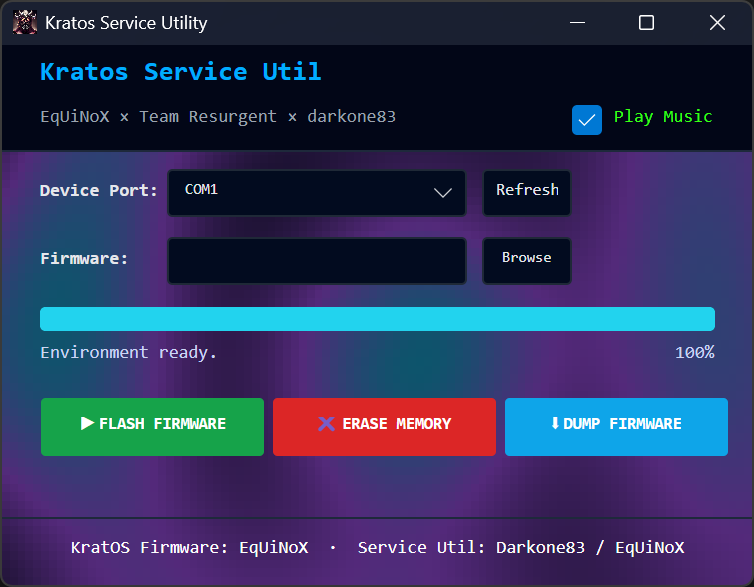

# KratosServiceUtility

A utility application for flashing firmware to the **Kratos** front button panel replacement for the original Xbox.

Kratos is the ultimate OGX front button panel replacement, crafted in collaboration between Team Resurgent and EqUiNoX Mods. It features seamless Alexa integration, audio playback support, fully customizable RGB LEDs, Modxo integration, PrometheOS compatibility, and over-the-air updates.

This utility provides a convenient way to flash and update the firmware on your Kratos device.